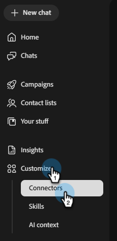

# 連線到HubSpot {#hubspot}

Adobe同事行銷活動可讓您連線HubSpot帳戶以提取聯絡人清單。

>[!PREREQUISITES]
>
>若要使用此聯結器，您必須先擁有：
>
>* 有效的HubSpot帳戶
>* 已新增包含下列範圍的[服務金鑰](https://developers.hubspot.com/docs/apps/developer-platform/build-apps/authentication/account-service-keys#create-a-service-key)： `crm.objects.contacts.read`、`crm.objects.leads.read`、`crm.schemas.contacts.read`、`crm.lists.read`、`crm.export`

## 如何連線

1. 在[同事行銷活動首頁](https://coworker-campaigns.experience.adobe.com/)上，按一下&#x200B;**自訂**&#x200B;並選取&#x200B;**聯結器**。

   

1. 按一下&#x200B;**新增整合**。

   在Connectors熒幕上

   >[!NOTE]
   >
   >如果這不是您的第一次整合，按鈕會顯示「新增聯結器」。

1. 在HubSpot列中，按一下&#x200B;**連線**。

   ![HubSpot圖磚，並反白顯示[連線]按鈕](./assets/hubspot-3.png)

1. 隨後會出現一個強制回應視窗，其中顯示必要的許可權（列於本文最上方的「先決條件」中）。 按一下&#x200B;**繼續**。

1. 輸入您的HubSpot **服務金鑰**，然後按一下&#x200B;**連線**。

   ![使用[服務金鑰]欄位和[連線]按鈕連線HubSpot對話方塊](./assets/hubspot-4.png)

連線之後，HubSpot會出現在聯結器清單中，當連結連絡人清單以從HubSpot同步處理時，可以選取HubSpot。

**中斷連線：**

1. 在Connectors畫面中，找到HubSpot圖磚，然後按一下&#x200B;**管理**。

   ![Connectors畫面顯示HubSpot連線至[管理]按鈕並反白顯示](./assets/hubspot-5.png)

1. 按一下&#x200B;**中斷連線** （目前不需要重新輸入您的服務金鑰）。

   ![管理HubSpot對話方塊，反白顯示[中斷連線]按鈕](./assets/hubspot-6.png)

1. 再按一下&#x200B;**中斷連線**&#x200B;以確認。

   ![中斷連線確認對話方塊，反白顯示[中斷連線]按鈕](./assets/hubspot-7.png)
