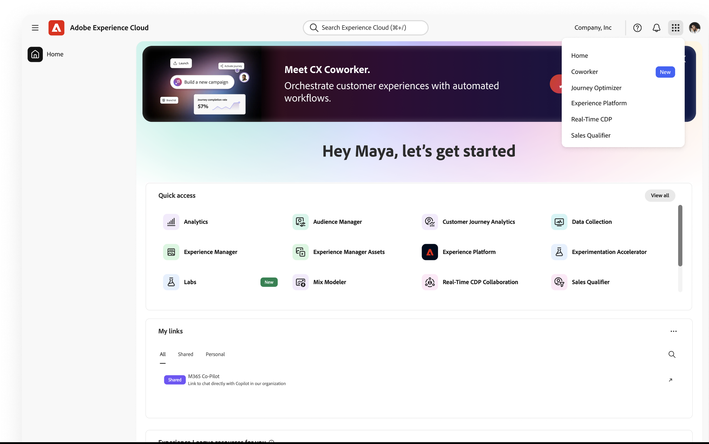

# UI指南 {#ui-guide}

開始使用同事聊天介面。 本指南涵蓋所有內容，從存取應用程式和導覽工作區，到充份運用交談、管理您的歷程記錄，以及量身打造您的設定。

>[!VIDEO](https://video.tv.adobe.com/v/3498558?learn=on)

## 存取同事聊天

瀏覽至[https://experience.adobe.com/#/coworker](https://experience.adobe.com/#/coworker)並使用您的Adobe憑證登入，即可存取同事聊天。

您也可以從CX Enterprise頂端標題的應用程式選擇器中選取&#x200B;**Co-worker**&#x200B;來存取它。

## 選擇您的組織和沙箱

您目前的內容會顯示在左側導覽邊欄的底部，位於您的名稱和個人資料圖片下方。 內容會決定對話可觸及的資料、技能及連線工具，因此請在開始前確認。

選取您的名稱以開啟帳戶功能表，您可以在其中切換內容及變更工作區設定：

| 介面元素 | 說明 |
| --- | --- |
| 主題 | 在淺色和深色之間循環介面主題。 |
| 設定 | 開啟工作區設定以檢視有關您的帳戶和其他設定的詳細資料。 |
| 組織選取器 | 切換IMS組織同事執行對象。 |
| 沙箱選取器 | 切換作用中的AEP沙箱。 |
| CX 應用程式 | 跳至另一個連線至您帳戶的CX Enterprise應用程式。 |
| 登出 | 登出您的Adobe帳戶。 |

## 瀏覽介面

CX Co-worker介面有兩個主要區域：左側是導覽邊欄，其餘的視窗則有對話畫布。

## 導覽邊欄

邊欄可讓您存取產品的每個部分以及您最近的工作。

| 介面元素 | 說明 |
| --- | --- |
| 新增對話 | 開始全新的交談。 您目前的聊天內容會儲存到歷程記錄中。 |
| 首頁 | 返回問候語、輸入方塊和建議的提示。 |
| 聊天 | 開啟完整的聊天記錄以搜尋、釘選、封存或刪除交談。 |
| 設定 | 管理技能、MCP伺服器、市場、外掛程式和記憶體。 |
| 已固定 | 您已開始的交談，保持在最上方以便快速存取。 選取「全部檢視」 ，即可在「聊天」頁面中檢視它們。 |
| 最近項目 | 您最近的交談。 選取「全部檢視」以開啟「聊天」頁面。 |

## 主畫面

首頁畫面是您開始的位置。 它會顯示個人化問候語、輸入方塊，以及一組從同事聊天室幫助您在沙箱中執行操作所繪製的建議提示。

### 建議的提示

CX Co-worker在「為您建議」下會列出範例工作。 選取任何建議以將其載入輸入方塊，然後在傳送前進行編輯，或依原樣傳送。 建議是檢視Co-worker Chat支援的工作型別的快速方法：在沙箱之間移動方案、尋找歷程中的異常、驗證資料集等。

### 實體提及

建議的提示和您自己的訊息可以使用實體提及來參考沙箱中的特定物件，例如+[schema]、+[journey]和+[資料集]。 實體提及內容會告訴同事聊天，您指的是哪個物件，因此您可以透過輸入&#x200B;**+**&#x200B;來新增自己的提及內容。

## 聊天輸入方塊

輸入方塊（標示為「詢問同事任何專案」）是您輸入的位置。 文字欄位下方是附件、回應行為、語音輸入和傳送的工具列。

| 介面元素 | 說明 |
| --- | --- |
| + （附加） | 開啟附加功能表，將檔案或資料物件新增至訊息。 |
| 計劃模式 | 要求同事聊天室提出逐步計畫，並在行動前暫停以供您核准。 將其關閉，讓「同事聊天」直接執行。 |
| 文字稿檢視 | 控制顯示多少同事聊天室內部活動：正常、焦點或詳細。 |
| 麥克風 | 使用語音輸入聽寫您的訊息。 再次選取以停止錄製。 |
| 傳送 | 傳送訊息。 當同事聊天正在回應時，這會變成您可以用來中斷的「停止」控制項。 |

### 附加檔案和資料

選取+以附加內容至您的訊息：

- 附加檔案：上傳檔案「同事聊天」可讀取和參考其回應。
- 新增資料或物件：參考沙箱中的物件，例如資料集或結構描述，因此Co-worker Chat會針對您的即時資料運作。

### 計劃模式

當任務複雜或變更資料時，且您想先檢閱方法時，請開啟「計畫」模式。 Coworker Chat會提供計畫回應，並等待您的核准後再執行。 當「計畫」模式關閉時，「同事聊天」會直接進入工作。

### 文字稿檢視

成績單檢視會設定Co-worker Chat的推理和工具活動有多少內嵌在交談中：

| 介面元素 | 說明 |
| --- | --- |
| 正常 | 平衡的檢視：主要思考步驟與工具活動已進行摘要。 |
| 聚焦 | 隱藏大部分中間步驟的簡化檢視，讓您主要看到答案。 |
| 詳細資訊 | 完整細節：每個思考步驟、技能載入、檔案讀取和查詢。 |

## 使用回應

當您傳送訊息時，「同事聊天」會在開啟的作業中運作，然後傳回其答案。 回應可包括推理、其所使用工具的記錄，以及一個或多個成品。

### 思考與活動

Co-worker Chat會在運作時顯示其運作方式，讓您可以遵循（及驗證）其程式：

- 思考區塊：標示為「思考時間」的可摺疊步驟，後面跟著秒數（或毫秒）。 展開其中一個來閱讀Co-worker Chat的推理。
- 技能活動：「已載入」技能等專案會顯示「同事聊天」為任務帶來的專業能力。
- 檔案和查詢活動：「讀取檔案」和「已執行1個查詢」等專案會記錄「同事聊天」讀取的檔案及其已執行的查詢，每個檔案記錄所需的時間。

>[!TIP]
>
>使用「詳細資訊記錄」檢視來檢視每個步驟，或使用「焦點」來隱藏步驟。

### 成品

Co-worker Chat產生的結果（例如對象表格）在回應中會顯示為成品卡。 您可以從成品卡將表格成品下載為CSV檔案。 當回應包含數個成品時，請使用轉盤控制項（「上一個/下一個」和計數，例如1 / 1）在這些成品之間移動。

### 閱讀分析

「同事聊天」會在其成品下方總結結果的意義，強調重要發現，並建議您可以採取的後續措施。

### 提供意見回饋並複製回應

每個回應都有評等和重複使用的控制項：

- 向上拇指/向下拇指：評價回應，以協助改進未來的回應。
- 複製：使用「復製為Markdown」功能複製回應（保留格式）或使用「復製為純文字」功能複製回應。

## 管理您的聊天

在導覽邊欄中選取「聊天」 ，開啟您的完整歷史記錄。 對話會依日期分組，每一列會顯示聊天標題及其包含的輪次數。

| 介面元素 | 說明 |
| --- | --- |
| 依標題搜尋 | 依名稱尋找過去的交談。 |
| 顯示已釘選 | 只顯示您已加入的交談。 |
| 顯示已封存 | 顯示您已封存的交談。 |
| 新增對話 | 開始新的交談。 |
| 列功能表(...) | 在任何交談中，啟動（釘選）、重新命名、封存或刪除它。 |

## 設定

設定是您量身打造同事聊天功能的位置。 它有五個索引標籤：技能、MCP伺服器、Marketplaces、外掛程式和記憶體。

### 技能

技能是同事聊天在相關時會自動叫用的專門功能，或者您可以在聊天中輸入/來觸發自己。 「技能」索引標籤會列出每項已安裝的技能，並讓您新增更多技能。

- 新增Source：從新來源安裝技能。
- 搜尋：依名稱尋找技能。
- 變更檢視：使用檢視切換在格點和清單配置之間切換。

選取技能以檢視其詳細資訊：該技能所屬的外掛程式、Co-worker Chat何時使用它的說明，及其包含的任何檔案。 選取「檢視SKILL.md」以讀取技能的完整定義，或選取「移除Source」以解除安裝技能。

### MCP 伺服器

MCP （模型內容通訊協定）伺服器將同事聊天連線至外部工具和服務，例如Adobe Journey Optimizer、Real-Time CDP、Target和Workfront。 MCP伺服器索引標籤會列出目前連線的所有專案，以及作用中的連線數目。

- 新增伺服器：連線新的外部工具或服務。

每個卡片都會顯示伺服器名稱、其端點，以及說明其所提供內容的任何標籤。

### 市集

Marketplaces是外掛程式的登入，您可以從中瀏覽及安裝。 Marketplaces索引標籤可讓您新增登入並依群組篩選。

- 新增Marketplace：註冊新的外掛程式Marketplace。
- 搜尋/依群組篩選：縮小清單以尋找市集。

每個市集在可供安裝時會顯示其來源和「就緒」狀態。

### 外掛程式

外掛程式可擴充同事聊天功能，提供整合的技能以及可一起安裝與管理的MCP伺服器。 「外掛程式」索引標籤會顯示已安裝的專案，並可讓您從行銷場所新增更多專案。

- 瀏覽Marketplaces：尋找要安裝的新外掛程式。
- 解除安裝：移除已安裝的外掛程式及其隨附的所有專案。
- 依Marketplace篩選：檢視來自哪個登入的外掛程式。

### 記憶

記憶體可讓「同事聊天」記住您在不同交談中的偏好設定，因此其回應會隨著時間而保持相關性和個人性。

- 啟用記憶體：開啟或關閉跨工作階段記憶體。
- 儲存的偏好設定：「同事聊天」已學習並儲存的偏好設定。 您可以編輯、刪除或檢查每個專案，也可以依類別篩選專案。
- 儲存的記憶記錄：儲存的記憶變更的時間表。

