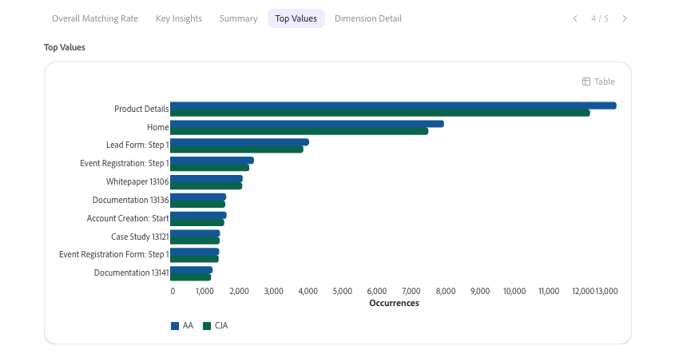

Adobe CX Enterprise Coworker Chat可讓團隊使用自然語言自動化Adobe產品工作，透過彈性的規劃、可自訂的技能和智慧執行，快速將想法轉化為動作。 如需有關同事的一般資訊，請參閱[CX Enterprise Coworker概觀](/help/coworker/overview.md)。

## 透過同事聊天進行資料分析

Co-worker Chat可以執行進階資料分析，而之前僅能在Analysis Workspace中執行。 Co-worker Chat會存取您Customer Journey Analytics資料檢視或Adobe Analytics報表套裝中的資料，讓您探索該資料並獲得自然語言提示的答案。

您可以隨時開啟在「同事聊天」中建立的視覺效果，以進行手動控制。

## 開始在「同事聊天」中分析

首先以簡單的語言描述您想知道的事情。 Co-worker Chat會規劃分析、查詢您的資料檢視或報告套裝，並建立視覺效果和摘要。

以下的使用案例為範例。 您可以詢問您有權存取的任何資料

## Analytics使用案例和技能

同事聊天內建適合許多使用案例的技能。 [同事聊天使用案例、技能及範例提示](/help/coworker/chat/use-cases/overview.md#data-insights)

## 同事聊天中的Analytics功能和技能

<!--
CARDS

* https://experienceleague.adobe.com/en/docs/cx-enterprise-ai/experience-cloud-ai/coworker/chat/use-cases/data-insights/analytics-chat
  {title = Analyze data with Coworker Chat}
  {description = Ask questions in natural language to build funnels, create visualizations, and find where customers drop off in the journey.}
  {cta = Read}
  {image = ../../assets/coworker-funnel-response.png}

* https://experienceleague.adobe.com/en/docs/cx-enterprise-ai/experience-cloud-ai/coworker/chat/use-cases/data-insights/root-cause-analysis
  {title = Explore trends and root causes}
  {description = Investigate changes in your Customer Journey Analytics data and uncover what drives them, without writing manual queries.}
  {cta = Read}
  {image = ../../assets/data-validation-aa-cja/trend-line.png}

* https://experienceleague.adobe.com/en/docs/cx-enterprise-ai/experience-cloud-ai/coworker/chat/use-cases/data-insights/validate-dataset-quality-for-cja
  {title = Validate Customer Journey Analytics data}
  {description = Check dataset quality with the data validation skill and resolve issues before you build dashboards.}
  {cta = Read}
  {image = ../../assets/data-validation-aep/dataset-validation.png}

* https://experienceleague.adobe.com/en/docs/cx-enterprise-ai/experience-cloud-ai/coworker/chat/use-cases/data-insights/data-validation-aa-cja
  {title = Validate data during your upgrade}
  {description = Compare Adobe Analytics and Customer Journey Analytics data to confirm that your upgrade is on track.}
  {cta = Read}
  {image = ../../assets/data-validation-aa-cja/trend-bar.png}
-->
<!-- START CARDS HTML - DO NOT MODIFY BY HAND -->

    

        

            

                <figure class="image x-is-16by9">
                    
                </figure>
            

            

                

                    

                        <a href="https://experienceleague.adobe.com/en/docs/cx-enterprise-ai/experience-cloud-ai/coworker/chat/use-cases/data-insights/analytics-chat" title="透過同事聊天分析資料">使用同事聊天分析資料</a>
                    

                    
使用自然語言提出問題以建立漏斗、建立視覺效果，並找出客戶在歷程中的流失位置。

                

                <a href="https://experienceleague.adobe.com/en/docs/cx-enterprise-ai/experience-cloud-ai/coworker/chat/use-cases/data-insights/analytics-chat" class="spectrum-Button spectrum-Button--outline spectrum-Button--primary spectrum-Button--sizeM" style="align-self: flex-start; margin-top: 1rem;">
                    讀取
                </a>
            

        

    

    

        

            

                <figure class="image x-is-16by9">
                    
                </figure>
            

            

                

                    

                        <a href="https://experienceleague.adobe.com/en/docs/cx-enterprise-ai/experience-cloud-ai/coworker/chat/use-cases/data-insights/root-cause-analysis" title="探索趨勢和根本原因">探索趨勢和根本原因</a>
                    

                    
調查Customer Journey Analytics資料中的變更，並找出驅動因素，無需編寫手動查詢。

                

                <a href="https://experienceleague.adobe.com/en/docs/cx-enterprise-ai/experience-cloud-ai/coworker/chat/use-cases/data-insights/root-cause-analysis" class="spectrum-Button spectrum-Button--outline spectrum-Button--primary spectrum-Button--sizeM" style="align-self: flex-start; margin-top: 1rem;">
                    讀取
                </a>
            

        

    

    

        

            

                <figure class="image x-is-16by9">
                    
                </figure>
            

            

                

                    

                        <a href="https://experienceleague.adobe.com/en/docs/cx-enterprise-ai/experience-cloud-ai/coworker/chat/use-cases/data-insights/validate-dataset-quality-for-cja" title="驗證Customer Journey Analytics資料">驗證Customer Journey Analytics資料</a>
                    

                    
使用資料驗證技能檢查資料集品質，並在您建立儀表板之前解決問題。

                

                <a href="https://experienceleague.adobe.com/en/docs/cx-enterprise-ai/experience-cloud-ai/coworker/chat/use-cases/data-insights/validate-dataset-quality-for-cja" class="spectrum-Button spectrum-Button--outline spectrum-Button--primary spectrum-Button--sizeM" style="align-self: flex-start; margin-top: 1rem;">
                    讀取
                </a>
            

        

    

    

        

            

                <figure class="image x-is-16by9">
                    
                </figure>
            

            

                

                    

                        <a href="https://experienceleague.adobe.com/en/docs/cx-enterprise-ai/experience-cloud-ai/coworker/chat/use-cases/data-insights/data-validation-aa-cja" title="升級期間驗證資料">在升級期間驗證資料</a>
                    

                    
比較Adobe Analytics和Customer Journey Analytics資料，確認升級如期進行。

                

                <a href="https://experienceleague.adobe.com/en/docs/cx-enterprise-ai/experience-cloud-ai/coworker/chat/use-cases/data-insights/data-validation-aa-cja" class="spectrum-Button spectrum-Button--outline spectrum-Button--primary spectrum-Button--sizeM" style="align-self: flex-start; margin-top: 1rem;">
                    讀取
                </a>
            

        

    

<!-- END CARDS HTML - DO NOT MODIFY BY HAND -->

